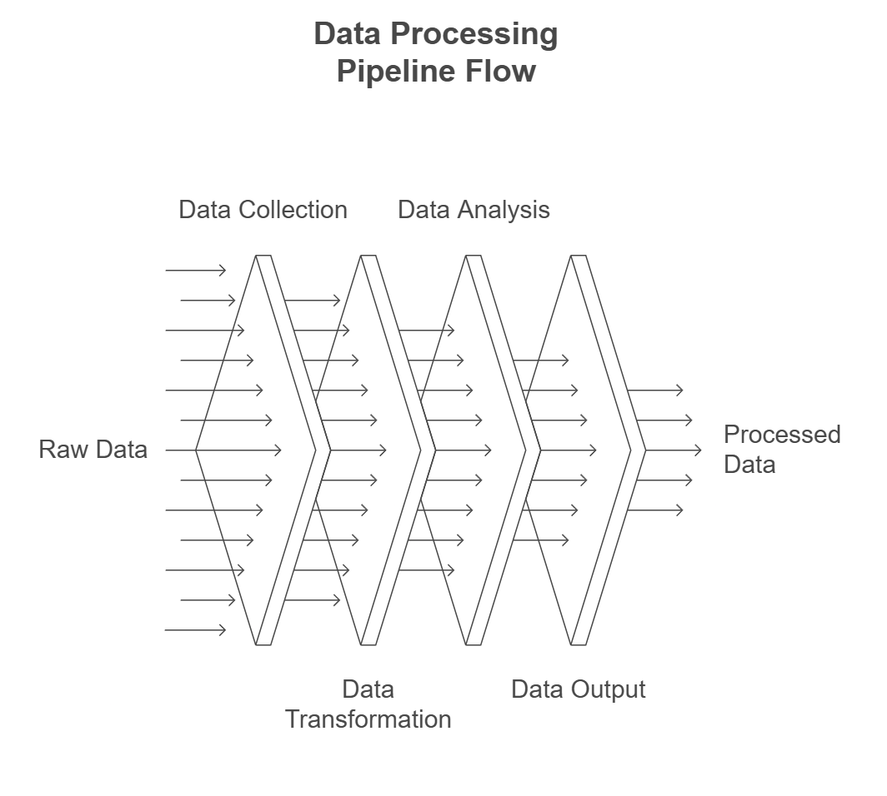
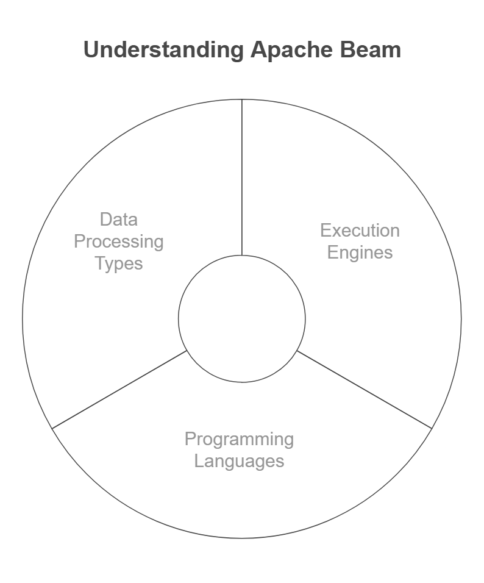
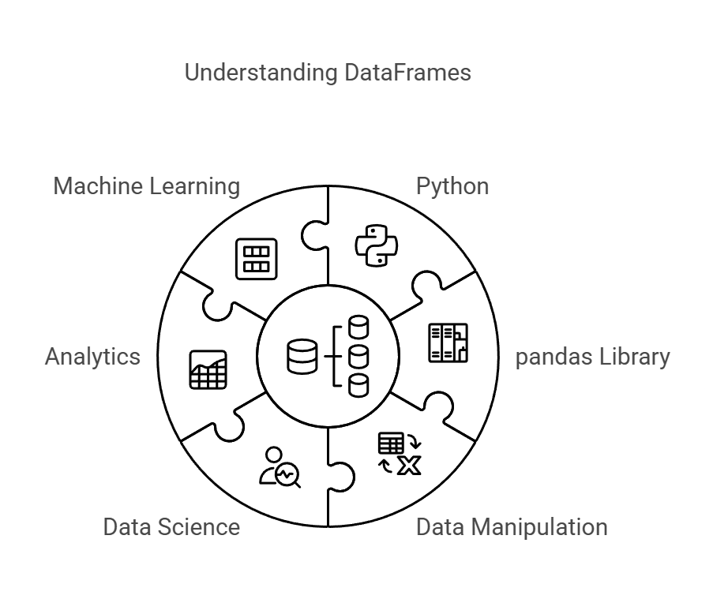
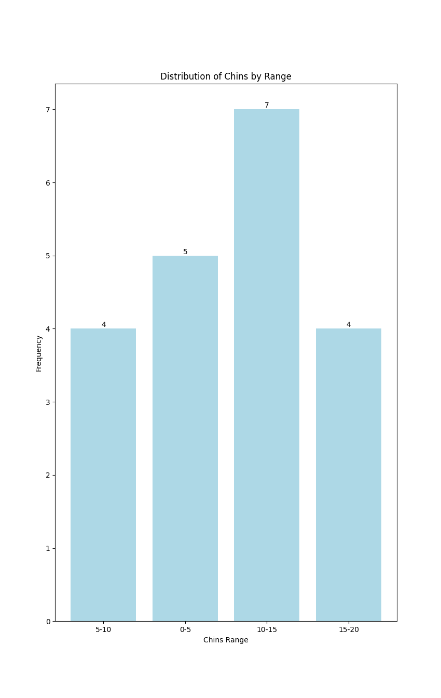

# 🚀 Pipelines (First Approach)

## ➰ What's a pipeline?

✅ Sequence of **data** processing **steps**, where the **output** of one step becomes the **input** for the next. <br>
✅ Commonly used in **data engineering**, **machine learning**, and **software development** to automate **workflows** and ensure efficient processing.



## 🅱️ What's Apache-Beam?

✅ **Apache Beam** is a framework for **batch** and **streaming data processing**. <br>
✅ It provides a **unified API** that can run on multiple execution engines. <br>
✅ Works well with **Google Cloud Dataflow**, **Apache Flink**, and **Apache Spark**. <br>
✅ Supports **Python**, **Java**, and **Go** for pipeline development.



# 👨‍💻 Preparing to code 

### Install Apache Beam in Python

- To install Apache Beam in Python, follow these steps:

1️⃣ Install Using pip:

```
pip install apache-beam
```

2️⃣ _Install Apache Beam with Google Cloud Support (Optional)_: 
    - _This includes additional dependencies for Google Cloud Storage, Pub/Sub, and BigQuery_

```
pip install apache-beam[gcp]
```

3️⃣ Verify Installation:

```
import apache_beam as beam

print(beam.__version__)
```

## 📄 What's a DataFrame

✅ A **DataFrame** is a tabular structure for handling structured data in **Python**.<br>
✅ It is part of the **pandas library** and supports fast **data manipulation**.<br>
✅ It is widely used in **data science**, **analytics**, and **machine learning**.



### Install pandas

1️⃣ Install Using pip:

```
pip install pandas
```

2️⃣ Verify Installation:

```
import pandas as pd

print(pd.__version__)
```

### Install scikit-learn and call a Dataset

1️⃣ Install Using pip:

```
pip install scikit-learn
```

2️⃣ Verify Installation:

```
import sklearn

print(sklearn.__version__)
```

3️⃣ Call a dataset to work with it: <br>

```
from sklearn.datasets import load_linnerud
```

4️⃣ Transform it into a DataFrame: <br>

```
from sklearn.datasets import load_linnerud

dt = load_linnerud()  
df = pd.DataFrame(dt.data, columns=dt.feature_names)

print(df)
```

---

# 🛠 Code Explanation - 'pipeline' folder

## 💻 1. pipeline.py

### 👨‍💻 Explanation of the Code:

- This **code** will check if the **'Chins'** field meets the condition:
    - If **'Chins'** is **greater than 10**.
    - It will only display **'True'** or **'False'** if **'Chins'** meets the previous condition."

### ✅ Example Output:

- **Original Dataset**

```
Chins  Situps  Jumps
5      162     60
2      110     60
12     101     101
15     250     80
```

- **Output .csv (Chins > 10)**

```
Chins
False
False
True
True
```


---

## 💻 2. pipeline_to_csv.py

### 👨‍💻 Explanation of the Code:

- This **code** will check if the **'Chins'** field meets the condition:
    - If **'Chins'** is **greater than 10**.
    - Only the **'Chins'** field will be displayed, along with whether it meets the previous condition.

### ✅ Example Output:

- **Original Dataset**

```
Chins  Situps  Jumps
5      162     60
2      110     60
12     101     101
15     250     80
```

- **Output .csv (Chins > 10)**

```
Chins
12
15
```

---

## 💻 3. pipeline_to_dataframe.py

### 👨‍💻 Explanation of the Code:

- This **code** will check if the **'Chins'** field meets the condition:
    - If **'Chins'** is **greater than 10**.
    - It will display all fields if the **'Chins'** field meets the previous condition.

### ✅ Example Output:

- **Original Dataset**

```
Chins  Situps  Jumps
5      162     60
2      110     60
12     101     101
15     250     80
```

- **Output .csv (Chins > 10)**

```
Chins,Situps,Jumps
12,101,101
15,250,80
```

---

## 💻 4. pipeline_filtered_T_F_csv.py 

### 👨‍💻 Explanation of the Code:

- This **code** will check if the **'Chins'** field meets the condition:
    - If **'Chins'** is **greater than 10**.
    - It will display all fields and add a new field (**Chins>10)** indicating whether the **'Chins'** field meets the previous condition:
        - **'True'** if it does.
        - **'False'** if it does not.

### ✅ Example Output:

- **Original Dataset**

```
Chins  Situps  Jumps
5      162     60
2      110     60
12     101     101
15     250     80
```

- **Output .csv (Chins>10)**

```
Chins,Situps,Jumps,Chins(>10)
5,162,60,False
2,110,60,False
12,101,101,True
15,250,80,True
```

---

## 💻 5. pipeline_group.py

### 👨‍💻 Explanation of the Code:

- This code will help us group the **'Chins'** field into **4 ranges**:

    - 0-5
    - 5-10
    - 10-15
    - 15-20

### ✅ Example Output:

- **Original Dataset**

```
Chins  Situps  Jumps
5      162     60
2      110     60
12     101     101
15     250     80
8      150     70
6      200     84
```

- **Output .csv**

```
Chins_Range,Count
0-5,2
5-10,2
10-15,1
15-20,1
```

---

## 💻 6. pipeline_group_plot.py

### 👨‍💻 Explanation of the Code:

- This code will categorize the 'Chins' data into four ranges:

    | Chins |
    |-------|
    |  0-5  |
    |  5-10 |
    | 10-15 |
    | 15-20 |
    | 20-25 |
    | 25-30 |

- It will also display the results as a bar chart.

### ✅ Example Output:

- **Original Dataset**

```
Chins  Situps  Jumps
5      162     60
2      110     60
12     101     101
15     250     80
8      150     70
6      200     84
```

- **Output .csv**

```
0-5,2
5-10,2
10-15,1
15-20,1
```

- **Chart**



---

## 💻 7. pipeline_group_2.py

### 👨‍💻 Explanation of the Code:

- This code will perform two tasks, adding two new fields to the data:

    1. Categorize the 'Chins' field into four ranges.

        | Chins |
        |-------|
        |  0-5  |
        |  5-10 |
        | 10-15 |
        | 15-20 |
        | 20-25 |
        | 25-30 |

    2. Recategorize the 'Chins' field to determine if it is above or below the average.

### ✅ Example Output:

- **Original Dataset**

```
Chins  Situps  Jumps
5      162     60
2      110     60
12     101     101
12     105     37
```

- **Output .csv**

```
Chins,Situps,Jumps,Chins_Range,Chins_vs_Avg
5.0,162.0,60.0,5-10,Below Average
2.0,110.0,60.0,0-5,Below Average
12.0,101.0,101.0,10-15,Above Average
12.0,105.0,37.0,10-15,Above Average
```

---

## 💻 8. pipeline_all_fields.py

### 👨‍💻 Explanation of the Code:

- This code will perform two tasks, adding two new fields to the data:

    1. Categorize the 'Chins', 'Situps' and 'Jumps' fields into four ranges.

    | Chins | Situps | Jumps |
    |-------|--------|-------|
    |  0-5  |  0-50  |  0-25 |
    |  5-10 | 50-100 | 25-50 |
    | 10-15 |100-150 | 50-75 |
    | 15-20 |150-200 |75-100 |
    | 20-25 |200-250 |100-125|
    | 25-30 |250-300 |125-150|

    2. Recategorize the 'Chins', 'Situps' and 'Jumps' field to determine if it is above or below the average.

### ✅ Example Output:

- **Original Dataset**

```
Chins  Situps  Jumps
5      162     60
2      110     60
12     101     101
12     105     37
```

- **Output .csv**

```
Chins,Situps,Jumps,Chins Range,Situps Range,Jumps Range,User,Chins_vs_Avg,Situps_vs_Avg,Jumps_vs_Avg
5.0,162.0,60.0,5-10,150-200,50-75,User 1,Below Average,Above Average,Below Average
2.0,110.0,60.0,0-5,100-150,50-75,User 2,Below Average,Below Average,Below Average
12.0,101.0,101.0,10-15,100-150,100-125,User 3,Above Average,Below Average,Above Average
12.0,105.0,37.0,10-15,100-150,25-50,User 4,Above Average,Below Average,Below Average
```

---

# 🛠 Code Explanation - 'machine_learning' folder

## 💻 1. eda.py

### 👨‍💻 Explanation of the Code:

- This code will allow us to analyze the available information to determine what type of analysis we can perform afterward.

- Three analyses (so far) will be conducted:

    1. Dataset report.
    2. Histograms.
    3. Density analysis.

- Finally, the reports will be downloaded as a PDF file.

### ✅ Example Output:

- I will not display the outputs, as they are saved as images and can be accessed from the **'downloads'** folder.

## 💻 2. advanced_statistical_analysis

### 👨‍💻 Explanation of the Code:

- In this code, we will perform two analyses using three variables: 'Chins', 'Jumps', and 'Situps':

1. Hypothesis testing
2. Clustering

- More code may be added in the future. For now, this analysis is conducted to test how it works.

### ✅ Example Output:

#### hypothesis_testing:

```
Mean Situps: 145.55
Mean Jumps: 70.3
T-statistic: 24.8380
P-value: 0.0000
We reject the null hypothesis: the means are significantly different.
```

```
Mean Jumps: 70.3
Mean Chins: 9.45
T-statistic: 22.5460
P-value: 0.0000
We reject the null hypothesis: the means are significantly different.
```

```
Mean Chins: 9.45
Mean Situps: 145.55
T-statistic: -53.9819
P-value: 0.0000
We reject the null hypothesis: the means are significantly different.
```

#### clustering:

```
Iteration 0 - Silhouette Score: 0.57

Iteration 1 - Silhouette Score: 0.53

Iteration 2 - Silhouette Score: 0.55
```